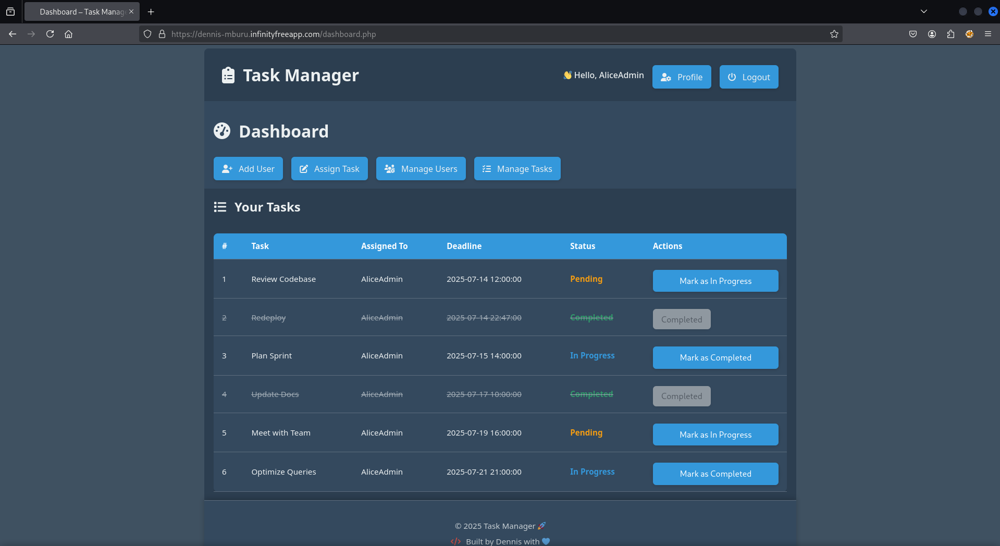
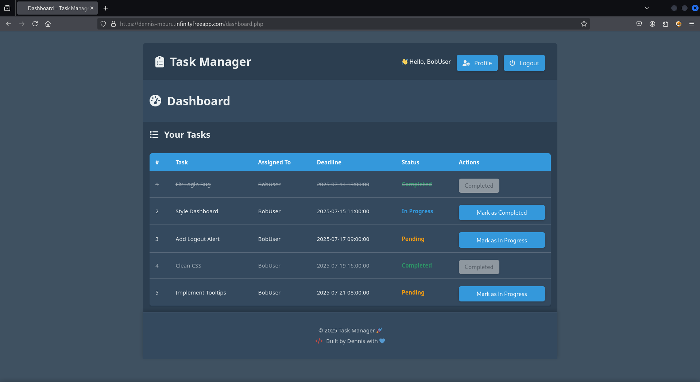
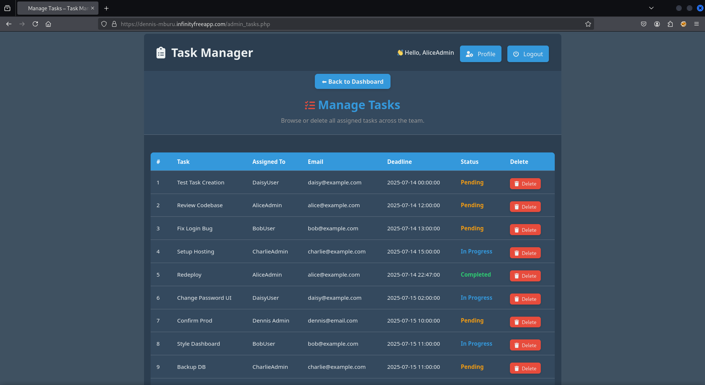
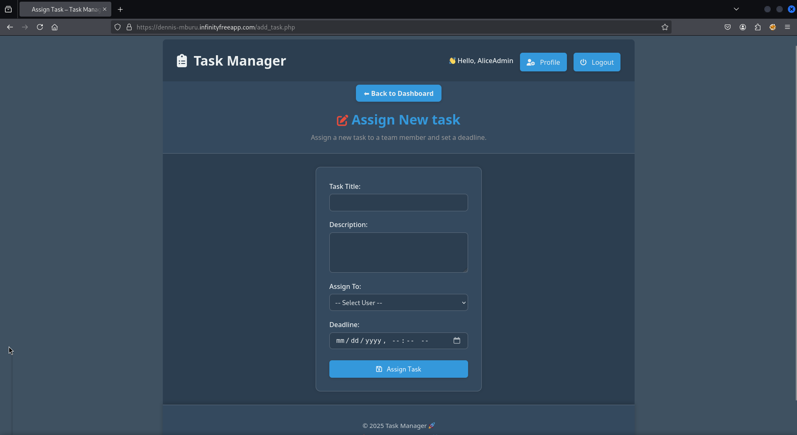
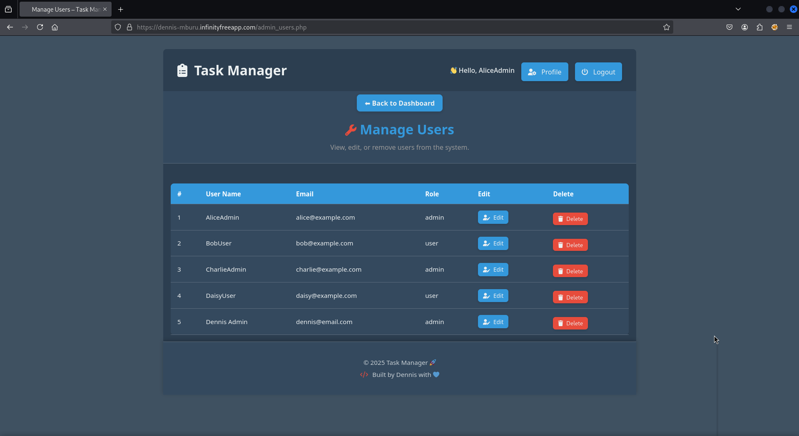
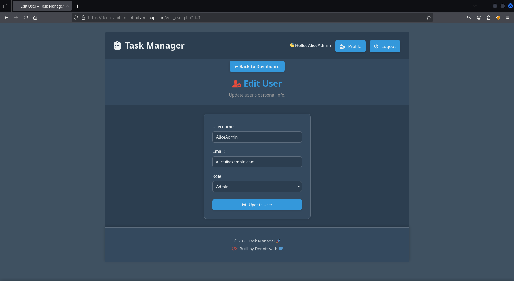
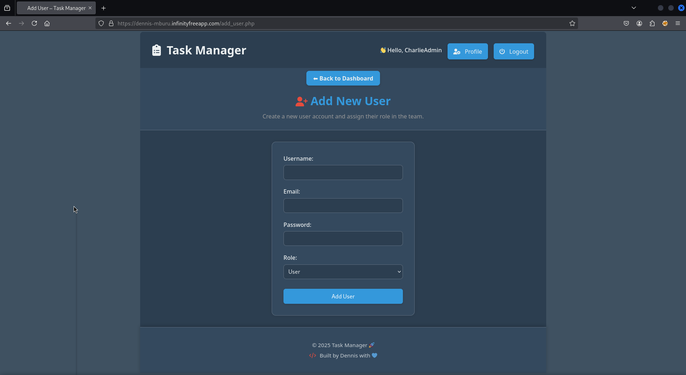
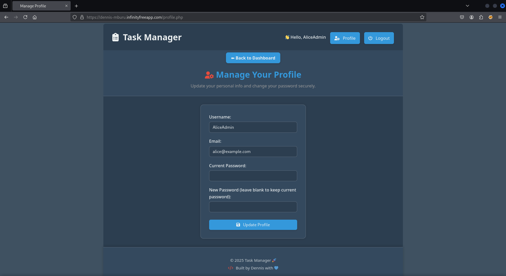
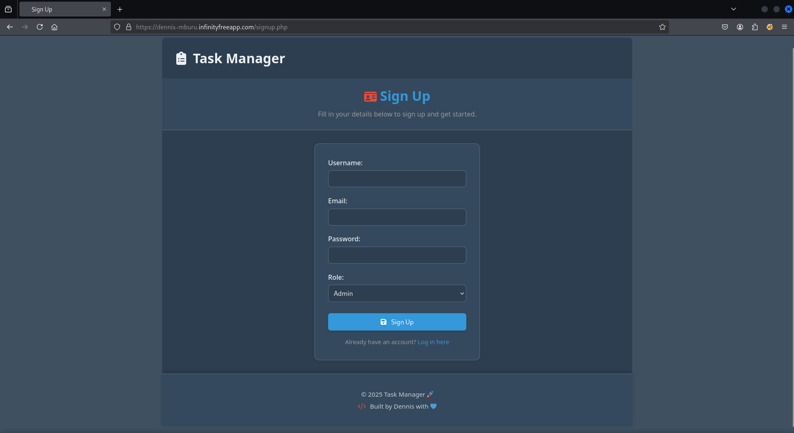
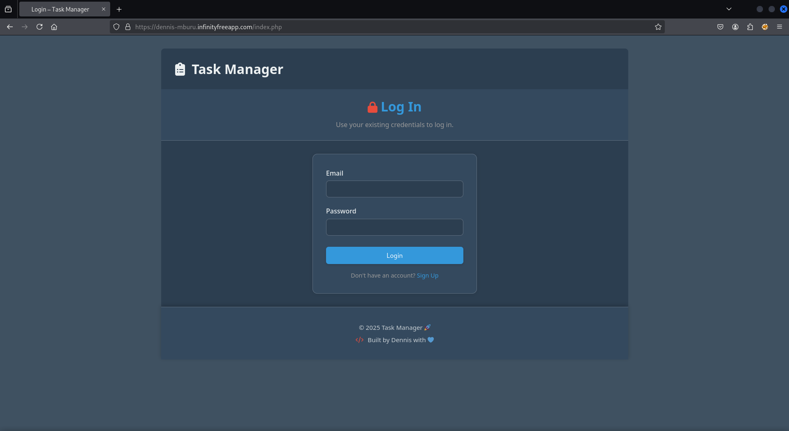

# ✅ Task Manager Web App

A lightweight PHP-based task management system designed for assigning, tracking, and updating tasks across different users with role-based access. Built using raw PHP, MySQL, and vanilla JavaScript — no frameworks.

---

## 🚀 Live Deployment

🌐 [Deployed App](https://dennis-mburu.infinityfreeapp.com/index.php)  
📁 [Project Repository](https://github.com/dennis-mburu/task-manager-php)

> ⚠️ _Note: The deployed version may have minor limitations due to free hosting restrictions._

---

## ✨ Features

### 👩‍💼 Admin Functionalities

- Add, update, or delete users
- Assign tasks to users with deadlines
- Manage all tasks and all users
- Email notifications for task assignments (⚙️ Configurable)

### 🙋‍♂️ User Functionalities

- View only their own assigned tasks
- Update task status (Pending → In Progress → Completed)
- Edit their own profile and change password

### 📊 General

- Simple but elegant responsive UI
- Role-based access control
- Session-based login/logout system
- Passwords securely hashed

---

## 🚀 Getting Started

To get the application up and running locally, follow the setup outline below:

### 🔁 1. Clone the Repository

Start by cloning the project repository to your local development environment.

### 🛠 2. Set Up Your Development Stack

Ensure that you have the following software installed and configured:

- Apache2 web server (e.g., via XAMPP, LAMP, or WAMP)
- PHP (version 8.1+ recommended)
- MySQL or MariaDB

### 🗄 3. Create the Database

Log into your local MySQL database and create a new database named: **task_manager**

Once the database is created, import the `task_manager.sql` file (sql dumpfile) provided in the root of the project. This SQL file will automatically create the necessary tables (`users`, `tasks`) and populate them with sample users and tasks for testing.

### 🔐 4. Configure Database Connection

In the file located at: `includes/db.php` update the database connection credentials (`host`, `user`, `password`, `db`) to match your local environment settings. This allows the application to communicate with your MySQL database.

### 🔑 5. Login Credentials

You have **two options** for accessing the application:

#### ✅ Option 1: Create Your Own Account

You can register a new user through the built-in **Sign Up** page:

- Go to the `/signup.php` page on your local or deployed version.
- Fill in the required details: **Username**, **Email**, **Password**, and select your **Role**.
- If you choose **Admin**, you’ll be able to assign tasks to yourself or others.
- If you choose **User**, you’ll only see and manage tasks assigned to you.

This is the recommended option if you want to simulate a fresh user flow.

---

#### 🧪 Option 2: Use the Sample Accounts from the SQL Dump

The `task_manager.sql` file includes **four sample users**:

- **2 Admins** and **2 Users**, each with sample credentials.
- You can use these to log in and test the full functionality right away.

> 🔍 Check the `task_manager.sql` file directly to find the sample **emails** and default **passwords** for login.

---

## 6. 🧪 Run the Application

With everything set up, launch your preferred browser and visit: `http://localhost/your-folder-path-being-served/index.php`. You should be greeted by the login page and be able to access the dashboard after logging in.

---

> ⚠️ Disclaimer
> This app was built for educational and demonstration purposes.
> Please do not use it as-is in production without adding proper validation, rate-limiting, and CSRF protection.

---

## 📸 Screenshots

### 🧑‍💼 Admin Dashboard

View of the main dashboard interface for Admin users, showing access to management tools, and their own assigned tasks.

### 🙋‍♂️ Normal User Dashboard

What regular users see when they log in — a simplified task overview with status indicators and ability to update their tasks - No access to management tools.

### 🗂️ All Task Management (Admin)

Admin interface for task progress tracking across the entire team - including delete task functionality.

### 📝 Admin Task Assignment Form

This form allows Admins to assign tasks to any user in the system.
Admins can set:

- Task title and description
- Deadline (with a date and time picker)
- Select an assignee from the dropdown list of all available users
  

### 👥 User Management (Admin)

A dedicated admin panel to manage all existing user accounts — update, or delete users.

### 👤 Admin User Editing Form

The Admin side pre-populated form for editting users. Admins can update any users information including admin rights, but **not** the user's passwords.

> _Note: Admins can only set passwords for users during new user enrollment, after which the new user is required to change the admin assigned password after logging in._

### 👤 Admin User Enrollment Form

The onboarding form used by admins to create new user accounts, including granting admin rights, within the system.

### 👤 Profile Management (All Users)

All Users (Admin or normal user) can update their personal information, including password changes if previously assigned by admins.

### 📝 Signup Page

New users can register directly through this form to create either a user or admin account.

### 🔐 Login Form/Landing page

Accessible to all users (Admins, normal users, and the public).This is the starting point for authentication into the app, and Includes a link to the signup page for completely new users.

